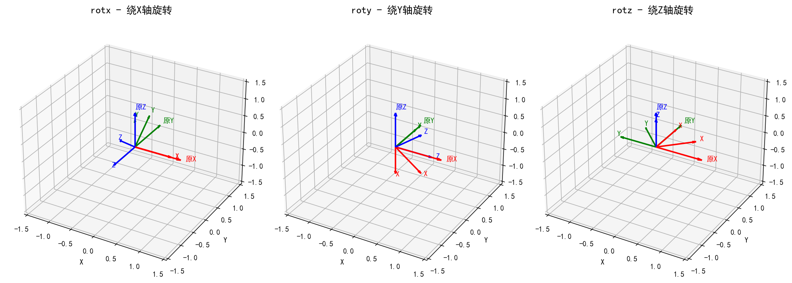
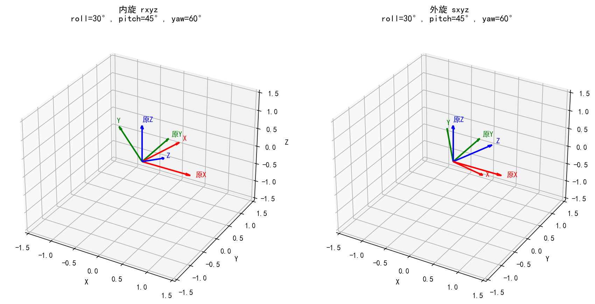
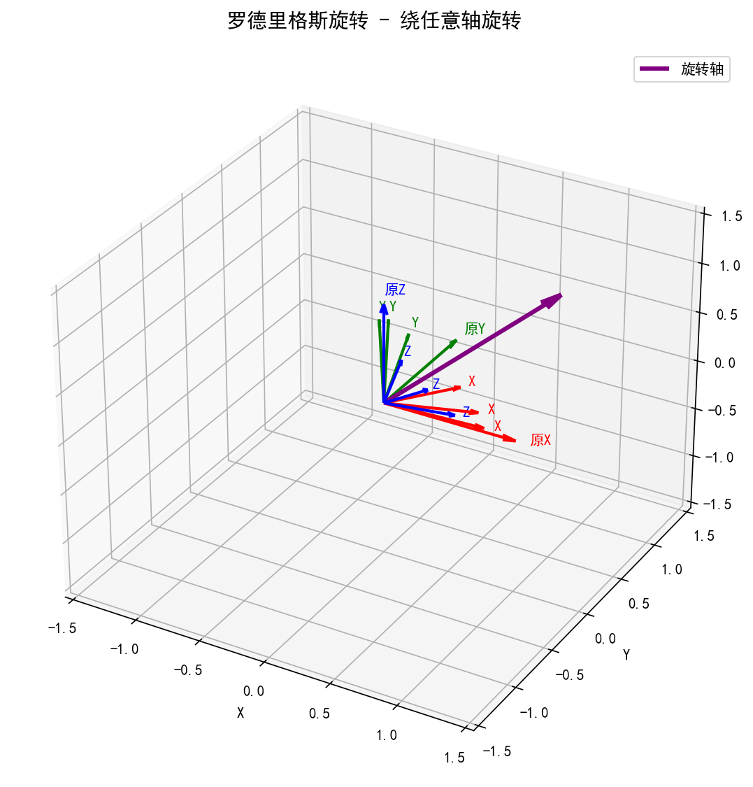
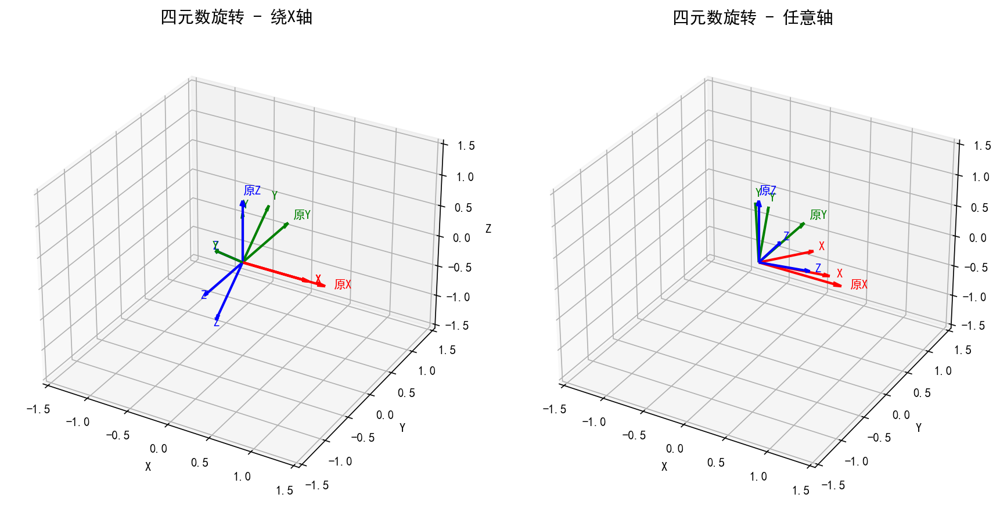
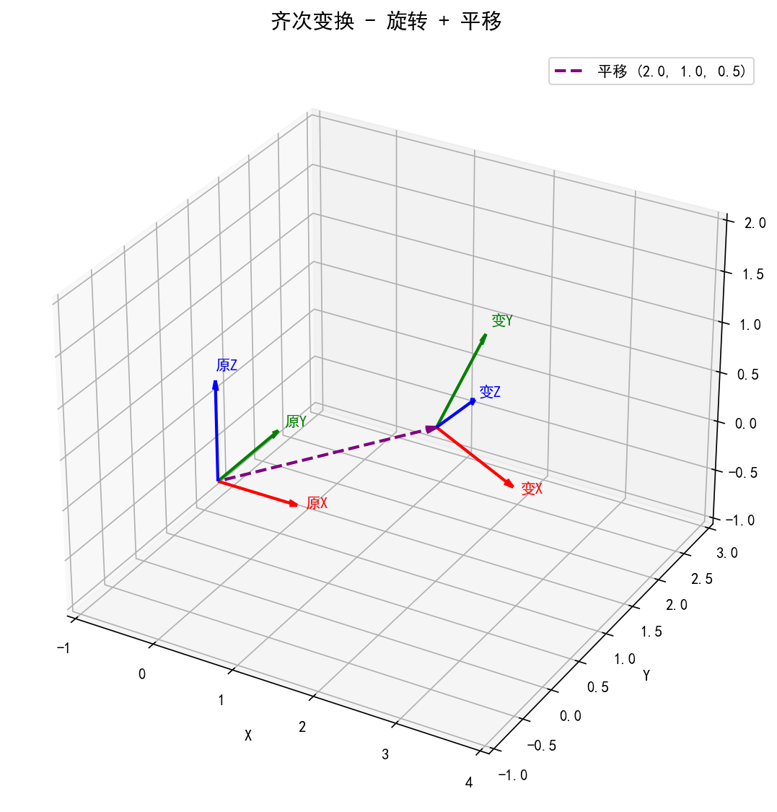
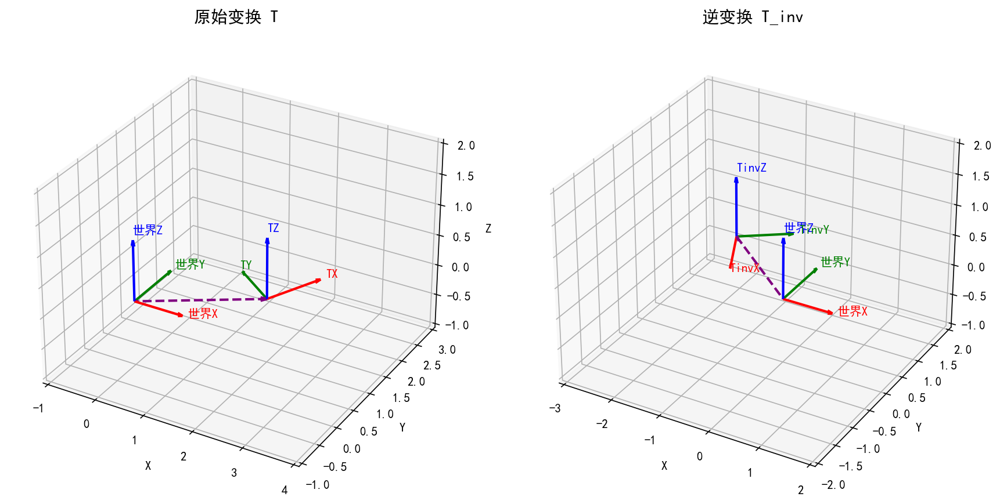

# 3D旋转变换工具库

一个用于3D空间旋转和变换计算的Python工具库，包含旋转矩阵、欧拉角、四元数、齐次变换等常用功能。

## 功能特性

- **基本旋转矩阵**: `rotx`, `roty`, `rotz` - 绕单轴旋转
- **欧拉角转换**: 支持内旋(rxyz)和外旋(sxyz)两种方式
- **罗德里格斯公式**: 绕任意轴旋转
- **四元数**: 四元数与旋转矩阵互转
- **齐次变换**: 4x4变换矩阵操作
- **李群/李代数**: SO3、SE3相关运算
- **螺旋轴**: 螺旋运动表示

## 安装依赖

```bash
pip install numpy matplotlib pytest
```

## 快速开始

```python
import numpy as np
from angle_function import rotx, roty, rotz, euler_to_rot, quat_to_rot

# 绕X轴旋转45度
R = rotx(np.pi / 4)

# 欧拉角转旋转矩阵 (内旋)
euler = [np.pi/6, np.pi/4, np.pi/3]  # roll, pitch, yaw
R = euler_to_rot(euler, "rxyz")

# 四元数转旋转矩阵
quat = np.array([0.707, 0.707, 0, 0])  # [w, x, y, z]
R = quat_to_rot(quat)
```

## 函数列表

| 函数 | 描述 |
|------|------|
| `rotx(angle)` | 绕X轴旋转 |
| `roty(angle)` | 绕Y轴旋转 |
| `rotz(angle)` | 绕Z轴旋转 |
| `euler_to_rot(euler, order)` | 欧拉角转旋转矩阵 |
| `rotk(axis, angle)` | 罗德里格斯旋转公式 |
| `quat_to_rot(quat)` | 四元数转旋转矩阵 |
| `rot_to_quat(rot)` | 旋转矩阵转四元数 |
| `rp_to_trans(R, p)` | 旋转+平移转齐次变换 |
| `trans_to_rp(trans)` | 齐次变换分解 |
| `trans_inv(trans)` | 齐次变换求逆 |
| `hat(axis)` | 向量转反对称矩阵 |
| `adjoint_mat(trans)` | 伴随矩阵 |

## 可视化示例

### 基本旋转矩阵


### 欧拉角转换 (内旋 vs 外旋)


### 罗德里格斯旋转


### 四元数旋转


### 齐次变换


### 变换矩阵求逆


## 运行测试

```bash
pytest tests/test_angle_function.py -v
```

## 运行可视化

```bash
python src/visualize_rotations.py
```

## 旋转方式说明

- **内旋 (rxyz)**: 绕自身局部坐标系旋转，R = Rx @ Ry @ Rz
- **外旋 (sxyz)**: 绕全局固定坐标系旋转，R = Rz @ Ry @ Rx